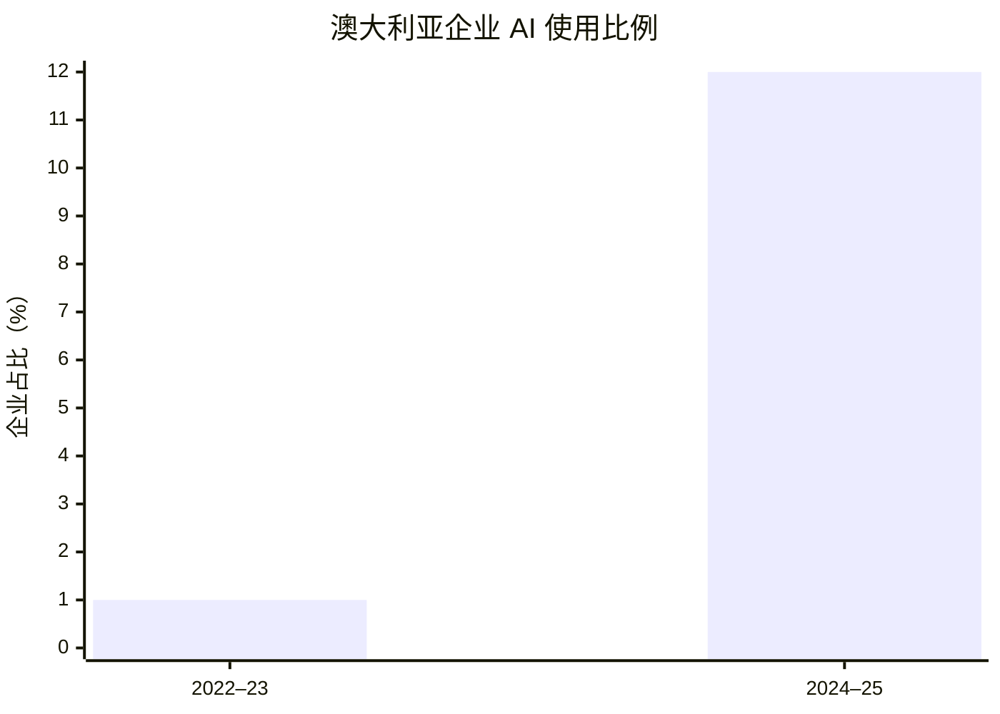
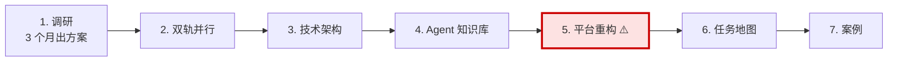

# 公众号图文增强版模板 (v2)

> **🚨 这是锁定版本。要改必须跟 linc 确认，agent 不自动改。**
>
> **来源**：基于 2026-08-07 「AI提效不是看省了多少时间，而是看"净可靠产出"——解读Tsipursky的管理者审计」的图文增强版。该文是「AI 管理现场」系列里版式最完整的一篇。
>
> **核心精神**：**评分透明** + **多版本同存** + **富视觉元素** + **多平台分发** — 把"文章打磨"做成可拆解、可对比、可复用的工艺。

---

## Part 1: 文章结构（4 个版本同存）

每一篇 v2 输出文档必须包含 **4 个版本**（用 `---` 分隔）：

```
[版本 1: 调整版]   纯文字打磨版，5 段式 + 加粗 + 短句
[版本 2: 图文增强版] 主推版本，含 callout + mermaid + 公式 + emoji
[版本 3: 小红书版] 短版图配文，3-5 段 + 封面叠字建议 + 标签
[版本 4: 即刻版]   100-200 字动态 + 反思钩子
```

> **为什么多版本同存**：调整版是「思考草稿」，图文增强版是「发布版」，小红书版和即刻版是「分发版」。同一篇文章能直接分发到 4 个平台，不需要重写。

---

## Part 2: 必备元素清单（图文增强版必须有）

### 2.1 封面图（首图）

- **比例**：900×383（2.35:1，公众号横版）
- **位置**：`![[封面 wikilink|900]]` 用 Obsidian wikilink 嵌入
- **叠字注释**：紧跟封面图后用 `<!-- 封面叠字建议：主标题「X」；副标题「Y」。白色 Heavy 字，居中偏上。 -->` 标注
- **主标题规范**：≤ 12 字
- **副标题规范**：≤ 20 字

### 2.2 开篇金句 callout

紧跟封面后，**第一句必须是金句**，用 Obsidian callout：

```markdown
> [!quote] （一句话警示/钩子）
> **只统计 AI 帮你省下的时间，却不统计你为了相信它而付出的时间。**
```

### 2.3 数字 / 数据冲击

先用 1-2 段叙事铺垫，**再用 1 个 mermaid 图 + 1 个表格**呈现数据：



```markdown
| 年度      | 使用 AI 的企业占比 | 直观变化         |
| ------- | ----------: | ------------ |
| 2022–23 |          1% | █            |
| 2024–25 |         12% | ████████████ |
```

> [!important] 速度与责任并没有同步增长
> 短短两年，企业 AI 使用比例达到原来的 **12 倍**。但很多企业仍然只统计「用了多少 AI」，没有回答「谁对 AI 的结果负责」。

### 2.4 概念定义 callout

引入新概念时用 `> [!important]` 框起，**加粗核心定义**：

```markdown
Tsipursky 提出了一个非常关键的衡量标准：**净可靠产出（net reliable output）**。

它不是计算 AI 表面上生成了多少、节省了多久，而是扣除检查、纠错、返工和补救成本之后，最终真正可用的产出。

$$
\text{净可靠产出}=\text{AI 带来的有用产出}-\text{检查}-\text{纠错}-\text{返工}-\text{补救}
$$


```

### 2.5 流程图（多步操作时）

每个流程图用 `flowchart LR/TD`，**关键节点用粗边框或红色填充**：



### 2.6 实战案例（独立成段）

每篇文章**至少 1 个真实场景案例**，用 `> [!example]` 或独立 `##` 章节：

```markdown
## 三、我真实遇见过这件事

这个问题其实在笔者的工作场景中就真实的遇见过：

领导就研究一个主题和豆包聊了很多，也产生出了完整的各类方案包括行动计划等，发给了各位管理者进行研究。

众多管理者开始无比称赞领导的与时俱进以及方案的完整性等...

但如果管理者深入到方案的细节、数据以及可执行性再来看的话，就会发现这里面的问题很多，落地性很差。

**真实的场景就是为了迎合领导，很少有管理者会跳出来指出这里面的各类问题。**
```

### 2.7 行动建议（CTA）

文末必须有一个行动建议章节，**用编号列表**，每条可执行：

```markdown
---

**行动建议**：

1、列出你的工作中哪些可以被取代的，不清楚，请点击阅读原文，专有的自检系统帮你来审计；

2、你觉得目前 AI 助力提供管理效能还有哪些注意点了，评论区来讨论。
```

### 2.8 置顶评论 + 合规说明（小红书版必带）

小红书和即刻版必须包含：

```markdown
**置顶评论**（关注主页·合规版）：你身边有哪种「看着省时间、实际更费劲」的 AI 场景？评论聊聊，我帮你拆第一步。

> 合规说明：小红书禁外链 / 禁公众号 / 禁微信导流；引导「关注主页」为平台内合规动作，主页简介承载「100天记录 / 私信『诊断』」等信息。
```

---

## Part 3: Emoji 章节标记规范（不超 8 个）

| Emoji | 用途 | 例 |
|-------|------| | 
| 📋 | 文章结构 / 打分表 | `## 📋 文章打分` |
| 📊 | 数据 / 统计 | `## 📊 先看一个不舒服的数字` |
| 🔍 | 深度分析 / 概念定义 | `## 🔍 省时间，不等于提效` |
| ⚠️ | 风险 / 警示 | `## ⚠️ 三个高风险信号` |
| 💡 | 洞察 / 实操建议 | `## 💡 我的三条建议` |
| 🟢🟡🔴 | 三档分级 / 红绿灯 | `## 🟢🟡🔴 红绿灯机制` |
| ✅ | 行动清单 / Checklist | `## ✅ 7 步走清单` |
| 🎯 | 目标 / 主张 | `## 🎯 我们的核心判断` |

> **不要在短文中塞满 emoji**。一篇文章 ≤ 8 个 emoji，每个章节最多 1 个。

---

## Part 4: 评分系统（10 维度，每篇必带）

文末放一张评分表，**原稿 vs 调整后**，带理由：

```markdown
## 📋 文章打分（YYYY-MM-DD，按《文章打分系统》）

| 维度 | 原稿 | 调整后 | 理由 |
|------|------|------|------|
| 标题力 | 7/10 | 7/10 | 反常识对比 + 权威，保留不动 |
| 钩子力 | 5/10 | 6/10 | 开头加粗成悬念 |
| ... | ... | ... | ... |
| **总分** | **56/100** | **68/100** | **修改级 → 修改级上沿** |
```

10 个维度（固定）：

1. 标题力
2. 钩子力（前 3 句）
3. 金字塔结构（小标题 + 段长）
4. 具体度（数据 / 案例 / 引用）
5. 原创性（独有观察 / 亲身经历）
6. 情感共鸣（扎心句 / 痛点）
7. 可行动性（CTA / Checklist）
8. 节奏与可读性（短段 / 加粗 / 空行）
9. 一句话记忆点（可被截图转发的句子）
10. 传播力（标题 + 案例 + 数字）

---

## Part 5: 排版规则

- 每段 ≤ 5 行（移动端单屏）
- 重点 ≤ 3 处加粗
- 短段 + 空行（呼吸感）
- 长段拆小段，必要时用引用块
- 配图 3-5 张（封面 + 2-3 张正文图）

---

## Part 6: 禁用词（公众号基线 + v2 加强）

### v2 加强禁用

| 类型 | 词 |
|------|-----|
| 同义反复 | 重要的事情说三遍、说白了、综上所述 |
| 鸡汤 | 努力就会成功、相信坚持的力量 |
| 假大空 | 颠覆、革命、重新定义、赋能、抓手 |
| 营销 | 完美、秒杀、碾压、家人们 |
| AI 词滥用 | 一站式、闭环、抓手、生态 |
| 模板化 | 大家好、今天给大家带来、小编觉得 |

### 标题禁用

- ❌ 震惊 / 速看 / 99% 的人
- ❌ 不转不是中国人
- ✅ 反常识 / 数字 / 痛点 / 对比 / 盘点 / 警示

---

## Part 7: 当 modify 阶段选 primary_style = 公众号-图文增强 时

按上面所有规范改稿：

- ✅ 必须生成 4 个版本（调整 / 图文增强 / 小红书 / 即刻）
- ✅ 图文增强版至少包含 1 个 mermaid 图 + 1 个 callout + 1 个表格
- ✅ 文末必须有 10 维度评分表
- ✅ 封面叠字建议用 `<!-- -->` 注释
- ✅ 总字数 2000-3000 字（图文增强版主推）
- ❌ 不删原稿（保留到 source.md.bak）
- ❌ 不编造数据（mermaid bar 数据须来自正文）
- ❌ 不混风格（极客代码块不放这里）

---

## Style Version

```
version: 1.0.0
frozen_at: 2026-08-26
based_on: 20260807 Tsipursky manager audit (图文增强版)
locked_by: linc
references:
  - "AI提效不是看省了多少时间，而是看"净可靠产出"——解读Tsipursky的管理者审计"
  - 2026-08-08 图文增强版（同名文章 vault 路径）
```

> **修改流程**：linc 改 → 更新 version → 通知 agent 重读。
> agent **不会**自动改这份。